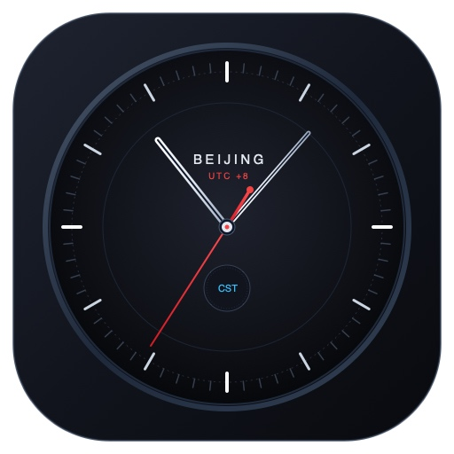

# 🇨🇳 macOS 菜单栏北京时间与迷你日历小工具 (BeijingClock)

<p align="center">
  
  <br>
  <em>专为海外时区（美区等）Mac 用户打造的极简原生北京时间与迷你日历</em>
</p>

---

## ✨ 核心特性

- 🚀 **100% 纯原生**：基于 Swift / AppKit 打造，极致轻量，运行几乎 **0% CPU**、几 MB 内存。
- 🕒 **强锁定北京时区**：固定 `Asia/Shanghai` (UTC+8) 时区，无论系统时区如何切换或伪装，菜单栏与日历始终精确显示北京时间与中国日期。
- 📅 **全新「北京时间迷你日历」浮窗（NSPopover）**：
  - **左键点击菜单栏时间**：即可流畅展开迷你日历面板。
  - **实时时间看板**：大字显示中国当天年月日与星期、秒级跳变时钟、以及一键复制完整时间戳（含 UTC+8）。
  - **时差提示**：清晰标明本机系统时区时间与相对北京时间的时差（如 `比北京慢 15 小时`）。
  - **精准月历视图**：完全基于北京时间排布 42 格月历，醒目高亮中国时区的“今天”（绝不受美区滞后影响）。
  - **翻页与快速返回**：支持 `‹` 上月、`›` 下月翻看，点击 `今天` 一键跳回当月。
  - **日期详情点选**：点击任意日期可选中高亮。
- ⚙️ **灵活自定义**：
  - 显示/隐藏日期（如 `8月26日`）
  - 显示/隐藏星期（如 `周三`）
  - 显示/隐藏秒数（如 `:45`）
  - 12 小时制 / 24 小时制切换
  - 中文风格 / 英文原生风格（如 `Wed Aug 26 5:24 PM`）
  - 前缀标记（无 / 🇨🇳 / 北京 / CST）
- 🖱️ **便捷交互**：
  - **左键点击**：展开/收起「迷你日历」面板。
  - **右键点击**（或点击浮窗左下角 `⚙️ 设置`）：直达格式设置菜单与开机自启动。
- 👻 **无界面无打扰**：无 Dock 图标、无多余主窗口，安静挂在菜单栏。

---

## 🛠️ 安装与使用

### 1. 从 Release 下载开箱即用
前往 [Releases 页面](../../releases) 下载最新的 `BeijingClock-macOS.zip`，解压后拖入 `应用程序 (Applications)` 文件夹即可运行。

### 2. 源码本地安装
```bash
# 克隆仓库
git clone https://github.com/YOUR_USERNAME/BeijingClock.git
cd BeijingClock

# 一键安装到应用程序并启动
bash install.sh
```

### 3. 本地编译
```bash
bash build.sh
```

---

## 📄 License
MIT License
